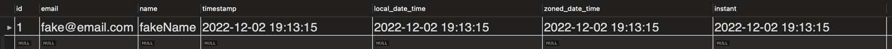

# Testing of java.time based classes regarding JDBC conversion with MySql and serialization via Jackson as it relates to TimeZone

### Setup for testing
- I have a MySql instance running in docker whose timezone is set to UTC (as docker containers naturally run in this
  manner by default).

The setup:
```sql
CREATE TABLE `user`
(
    `id`              int NOT NULL,
    `email`           varchar(255) DEFAULT NULL,
    `name`            varchar(255) DEFAULT NULL,
    `timestamp`       timestamp    DEFAULT NULL,
    `local_date_time` timestamp    DEFAULT NULL,
    `zoned_date_time` timestamp    DEFAULT NULL,
    `instant`         timestamp    DEFAULT NULL,
    PRIMARY KEY (`id`)
) ENGINE = InnoDB
  DEFAULT CHARSET = utf8mb4
  COLLATE = utf8mb4_0900_ai_ci;

INSERT INTO `db_example`.`user` (`id`, `email`, `name`, `timestamp`, `local_date_time`, `zoned_date_time`, `instant`)
VALUES (1, 'fake@email.com', 'fakeName', NOW(), NOW(), NOW(), NOW());

SELECT *
FROM db_example.user;
```

Notes:
- All time based columns are timestamp fields in MySql for this testing.
- The names of these columns indicate the datatype in Java that will be handling these fields.

The result (It is currently 2:13PM EST or 7:13PM UTC when running this script):


### When the JDBC connection is running in my local timezone (EST, -5:00HRS from UTC)

The values in Java when pulled from the MySql instance via JDBC:
```text
c.e.demo.controllers.UserController      : User{id=1, email='fake@email.com', name='fakeName', timestamp=2022-12-02 19:13:15.0, localDateTime=2022-12-02T19:13:15, zonedDateTime=2022-12-02T19:13:15-05:00[America/New_York], instant=2022-12-02T19:13:15Z}
```

What is serialized by Jackson through the RestController:
```json
{
  "id": 1,
  "email": "fake@email.com",
  "name": "fakeName",
  "timestamp": "2022-12-03T00:13:15.000+00:00",
  "localDateTime": "2022-12-02T19:13:15",
  "zonedDateTime": "2022-12-02T19:13:15-05:00",
  "instant": "2022-12-02T19:13:15Z"
}
```

### When UTC is set for the Spring Boot application
DemoApplication.java:
```java
    @PostConstruct
public void init(){
        TimeZone.setDefault(TimeZone.getTimeZone("UTC"));
        }
```

The values in Java when pulled from the MySql instance via JDBC:
```text
c.e.demo.controllers.UserController      : User{id=1, email='fake@email.com', name='fakeName', timestamp=2022-12-03 00:13:15.0, localDateTime=2022-12-03T00:13:15, zonedDateTime=2022-12-03T00:13:15Z[UTC], instant=2022-12-02T19:13:15Z}
```

What is serialized by Jackson through the RestController:
```json
{
  "id": 1,
  "email": "fake@email.com",
  "name": "fakeName",
  "timestamp": "2022-12-03T00:13:15.000+00:00",
  "localDateTime": "2022-12-03T00:13:15",
  "zonedDateTime": "2022-12-03T00:13:15Z",
  "instant": "2022-12-02T19:13:15Z"
}
```

### When UTC is set for the JDBC connection
application.properties:
```text
spring.jpa.properties.hibernate.jdbc.time_zone=UTC
```
Note: the Spring Boot application is not set to UTC and is running in EST for this test.

The values in Java when pulled from the MySql instance via JDBC:
```text
c.e.demo.controllers.UserController      : User{id=1, email='fake@email.com', name='fakeName', timestamp=2022-12-02 14:13:15.0, localDateTime=2022-12-02T14:13:15, zonedDateTime=2022-12-02T14:13:15-05:00[America/New_York], instant=2022-12-02T19:13:15Z}
```

What is serialized by Jackson through the RestController:
```json
{
  "id": 1,
  "email": "fake@email.com",
  "name": "fakeName",
  "timestamp": "2022-12-02T19:13:15.000+00:00",
  "localDateTime": "2022-12-02T14:13:15",
  "zonedDateTime": "2022-12-02T14:13:15-05:00",
  "instant": "2022-12-02T19:13:15Z"
}
```

### When UTC is set for the Spring Boot application and UTC is set for the JDBC connection
DemoApplication.java:
```java
    @PostConstruct
public void init(){
        TimeZone.setDefault(TimeZone.getTimeZone("UTC"));
        }
```

```text
spring.jpa.properties.hibernate.jdbc.time_zone=UTC
```

The values in Java when pulled from the MySql instance via JDBC:
```text
c.e.demo.controllers.UserController      : User{id=1, email='fake@email.com', name='fakeName', timestamp=2022-12-02 19:13:15.0, localDateTime=2022-12-02T19:13:15, zonedDateTime=2022-12-02T19:13:15Z[UTC], instant=2022-12-02T19:13:15Z}
```

What is serialized by Jackson through the RestController:
```json
{
  "id": 1,
  "email": "fake@email.com",
  "name": "fakeName",
  "timestamp": "2022-12-02T19:13:15.000+00:00",
  "localDateTime": "2022-12-02T19:13:15",
  "zonedDateTime": "2022-12-02T19:13:15Z",
  "instant": "2022-12-02T19:13:15Z"
}
```

### Findings
When working with timestamp data from MySql where the database set to run against UTC
And your Spring application is not running against UTC
And the JDBC connection set not to UTC
The below Java datatypes will produce inaccurate values.
- java.sql.Timestamp
- java.time.LocalDateTime
- java.time.ZonedDateTime
  This concern carries over to serialized values for these datatypes.

Only the java.time.Instant datatype consistently provided values when testing under these scenarios.

Please ensure that your Spring boot application is set to run against the UTC timezone
And also set your JDBC connection to run against the UTC timezone as well.
If that is done then all values in the Hibernate entities are accurate.
The values provided in serialization too are similarly accurate.
However, the LocalDateTime is not clearly indicating that the value provided is for UTC time.
- java.sql.Timestamp
- java.time.LocalDateTime (Use this only when the value stays within the Java application.  It should not be persisted in the db nor sent over any API externally.)
- java.time.ZonedDateTime
- java.time.Instant

#### TLDR;
- Please ensure the Spring boot application as well as the JDBC connection is set to run against UTC.  
- Only the ZonedDateTime and Instant java.time datatypes are recommended for use with time-base values that live externally to the application.
- Similarly, Timestamp datatypes should be used in MySql for similar reasons.
